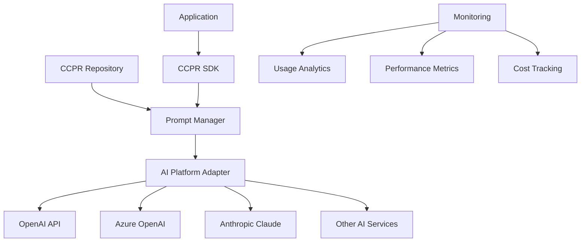

# AI Platform Integration Guide

## Overview
This guide provides comprehensive instructions for integrating CCPR prompts with various AI platforms and services. Learn how to connect your prompt repository with OpenAI, Azure OpenAI, Anthropic, and other AI providers for seamless automation.

## Supported AI Platforms

### Primary Integrations
- **OpenAI API**: GPT-3.5, GPT-4, and newer models
- **Azure OpenAI Service**: Enterprise-grade OpenAI integration
- **Anthropic Claude**: Claude 2, Claude Instant, and newer versions
- **Google PaLM API**: PaLM 2 and Bard integrations
- **AWS Bedrock**: Multi-model AI service integration

### Custom Integrations
- **On-Premises Models**: Hugging Face, local deployments
- **Specialized APIs**: Domain-specific AI services
- **Enterprise Solutions**: Custom AI platform integrations

## Integration Architecture

### High-Level Architecture


### Core Components
```yaml
Integration Components:
  prompt_manager:
    purpose: "Load and manage prompts from repository"
    responsibilities: ["version management", "caching", "validation"]
    
  platform_adapter:
    purpose: "Abstract AI platform differences"
    responsibilities: ["API calls", "error handling", "rate limiting"]
    
  response_processor:
    purpose: "Handle and format AI responses"
    responsibilities: ["parsing", "validation", "transformation"]
    
  monitoring_system:
    purpose: "Track usage and performance"
    responsibilities: ["logging", "metrics", "alerting"]
```

## Platform-Specific Integration

### OpenAI API Integration

#### Setup and Configuration
```python
# requirements.txt
openai>=1.0.0
ccpr-sdk>=2.0.0
python-dotenv>=1.0.0

# .env file
OPENAI_API_KEY=your_api_key_here
CCPR_REPOSITORY_PATH=/path/to/ccpr/repository
OPENAI_MODEL=gpt-4
```

#### Basic Implementation
```python
import openai
from ccpr_sdk import PromptManager
import os
from dotenv import load_dotenv

load_dotenv()

class OpenAIIntegration:
    def __init__(self):
        # Initialize OpenAI client
        self.client = openai.OpenAI(
            api_key=os.getenv('OPENAI_API_KEY')
        )
        
        # Initialize CCPR prompt manager
        self.prompt_manager = PromptManager(
            repository_path=os.getenv('CCPR_REPOSITORY_PATH')
        )
        
        self.model = os.getenv('OPENAI_MODEL', 'gpt-4')
    
    def execute_prompt(self, prompt_id, variables=None, model=None):
        """Execute a CCPR prompt using OpenAI API"""
        try:
            # Load prompt from repository
            prompt = self.prompt_manager.get_prompt(prompt_id)
            
            # Render prompt with variables
            rendered_prompt = prompt.render(variables or {})
            
            # Execute with OpenAI
            response = self.client.chat.completions.create(
                model=model or self.model,
                messages=[
                    {"role": "system", "content": prompt.system_message},
                    {"role": "user", "content": rendered_prompt}
                ],
                temperature=prompt.temperature,
                max_tokens=prompt.max_tokens
            )
            
            # Process and return response
            return self._process_response(response, prompt)
            
        except Exception as e:
            return self._handle_error(e, prompt_id)
    
    def _process_response(self, response, prompt):
        """Process OpenAI API response"""
        content = response.choices[0].message.content
        
        # Apply prompt-specific post-processing
        if prompt.output_format == 'json':
            try:
                import json
                content = json.loads(content)
            except json.JSONDecodeError:
                # Handle JSON parsing errors
                pass
        
        return {
            'content': content,
            'usage': response.usage,
            'model': response.model,
            'prompt_id': prompt.id,
            'prompt_version': prompt.version
        }

# Usage example
integration = OpenAIIntegration()

# Execute sentiment analysis prompt
result = integration.execute_prompt(
    prompt_id='classification/label_sentiment',
    variables={
        'input_text': 'I love this new feature! It works perfectly.'
    }
)

print(result['content'])
```

#### Advanced OpenAI Features
```python
class AdvancedOpenAIIntegration(OpenAIIntegration):
    def execute_with_functions(self, prompt_id, variables=None, functions=None):
        """Execute prompt with OpenAI function calling"""
        prompt = self.prompt_manager.get_prompt(prompt_id)
        rendered_prompt = prompt.render(variables or {})
        
        response = self.client.chat.completions.create(
            model=self.model,
            messages=[
                {"role": "system", "content": prompt.system_message},
                {"role": "user", "content": rendered_prompt}
            ],
            functions=functions,
            function_call="auto"
        )
        
        return self._process_function_response(response)
    
    def execute_streaming(self, prompt_id, variables=None):
        """Execute prompt with streaming response"""
        prompt = self.prompt_manager.get_prompt(prompt_id)
        rendered_prompt = prompt.render(variables or {})
        
        stream = self.client.chat.completions.create(
            model=self.model,
            messages=[
                {"role": "system", "content": prompt.system_message},
                {"role": "user", "content": rendered_prompt}
            ],
            stream=True
        )
        
        for chunk in stream:
            if chunk.choices[0].delta.content is not None:
                yield chunk.choices[0].delta.content
```

### Azure OpenAI Integration

#### Configuration
```python
from azure.identity import DefaultAzureCredential
from openai import AzureOpenAI
import os

class AzureOpenAIIntegration:
    def __init__(self):
        # Azure OpenAI configuration
        self.client = AzureOpenAI(
            api_key=os.getenv('AZURE_OPENAI_API_KEY'),
            api_version=os.getenv('AZURE_OPENAI_API_VERSION', '2024-02-15-preview'),
            azure_endpoint=os.getenv('AZURE_OPENAI_ENDPOINT')
        )
        
        self.deployment_name = os.getenv('AZURE_OPENAI_DEPLOYMENT_NAME')
        
        # Initialize CCPR prompt manager
        self.prompt_manager = PromptManager(
            repository_path=os.getenv('CCPR_REPOSITORY_PATH')
        )
    
    def execute_prompt(self, prompt_id, variables=None):
        """Execute prompt using Azure OpenAI"""
        prompt = self.prompt_manager.get_prompt(prompt_id)
        rendered_prompt = prompt.render(variables or {})
        
        response = self.client.chat.completions.create(
            model=self.deployment_name,  # Use deployment name for Azure
            messages=[
                {"role": "system", "content": prompt.system_message},
                {"role": "user", "content": rendered_prompt}
            ],
            temperature=prompt.temperature,
            max_tokens=prompt.max_tokens
        )
        
        return self._process_response(response, prompt)
```

### Anthropic Claude Integration

#### Setup and Implementation
```python
import anthropic
from ccpr_sdk import PromptManager

class ClaudeIntegration:
    def __init__(self):
        self.client = anthropic.Anthropic(
            api_key=os.getenv('ANTHROPIC_API_KEY')
        )
        
        self.prompt_manager = PromptManager(
            repository_path=os.getenv('CCPR_REPOSITORY_PATH')
        )
        
        self.model = os.getenv('CLAUDE_MODEL', 'claude-2')
    
    def execute_prompt(self, prompt_id, variables=None):
        """Execute prompt using Anthropic Claude"""
        prompt = self.prompt_manager.get_prompt(prompt_id)
        rendered_prompt = prompt.render(variables or {})
        
        # Claude-specific prompt formatting
        formatted_prompt = f"{anthropic.HUMAN_PROMPT} {rendered_prompt}{anthropic.AI_PROMPT}"
        
        response = self.client.completions.create(
            model=self.model,
            prompt=formatted_prompt,
            max_tokens_to_sample=prompt.max_tokens or 1000,
            temperature=prompt.temperature or 0.7
        )
        
        return {
            'content': response.completion.strip(),
            'model': self.model,
            'prompt_id': prompt.id,
            'prompt_version': prompt.version
        }
```

### Multi-Platform Adapter

#### Universal AI Integration
```python
from enum import Enum
from typing import Union, Dict, Any

class AIProvider(Enum):
    OPENAI = "openai"
    AZURE_OPENAI = "azure_openai"
    ANTHROPIC = "anthropic"
    GOOGLE_PALM = "google_palm"

class UniversalAIIntegration:
    def __init__(self):
        self.prompt_manager = PromptManager(
            repository_path=os.getenv('CCPR_REPOSITORY_PATH')
        )
        
        # Initialize platform-specific clients
        self.providers = {
            AIProvider.OPENAI: OpenAIIntegration(),
            AIProvider.AZURE_OPENAI: AzureOpenAIIntegration(),
            AIProvider.ANTHROPIC: ClaudeIntegration(),
        }
        
        # Default provider
        self.default_provider = AIProvider.OPENAI
    
    def execute_prompt(self, 
                      prompt_id: str, 
                      variables: Dict[str, Any] = None,
                      provider: AIProvider = None,
                      model: str = None) -> Dict[str, Any]:
        """Execute prompt on specified AI provider"""
        
        # Use default provider if not specified
        provider = provider or self.default_provider
        
        # Get the appropriate integration
        integration = self.providers[provider]
        
        # Execute the prompt
        return integration.execute_prompt(prompt_id, variables, model)
    
    def execute_multi_provider(self, 
                              prompt_id: str, 
                              variables: Dict[str, Any] = None,
                              providers: list = None) -> Dict[AIProvider, Dict[str, Any]]:
        """Execute same prompt across multiple providers for comparison"""
        
        providers = providers or [AIProvider.OPENAI, AIProvider.ANTHROPIC]
        results = {}
        
        for provider in providers:
            try:
                result = self.execute_prompt(prompt_id, variables, provider)
                results[provider] = result
            except Exception as e:
                results[provider] = {'error': str(e)}
        
        return results

# Usage example
ai_integration = UniversalAIIntegration()

# Single provider execution
result = ai_integration.execute_prompt(
    prompt_id='generation/generate_summary',
    variables={'input_text': 'Long article text here...'},
    provider=AIProvider.OPENAI
)

# Multi-provider comparison
comparison = ai_integration.execute_multi_provider(
    prompt_id='classification/label_sentiment',
    variables={'input_text': 'This product is amazing!'},
    providers=[AIProvider.OPENAI, AIProvider.ANTHROPIC]
)
```

## Advanced Integration Features

### Prompt Caching and Performance
```python
import redis
import json
from functools import wraps
from typing import Optional

class CachedAIIntegration:
    def __init__(self):
        self.ai_integration = UniversalAIIntegration()
        self.cache = redis.Redis(
            host=os.getenv('REDIS_HOST', 'localhost'),
            port=os.getenv('REDIS_PORT', 6379),
            decode_responses=True
        )
        self.cache_ttl = int(os.getenv('CACHE_TTL', 3600))  # 1 hour default
    
    def _generate_cache_key(self, prompt_id: str, variables: dict, provider: AIProvider) -> str:
        """Generate unique cache key for prompt execution"""
        import hashlib
        
        cache_data = {
            'prompt_id': prompt_id,
            'variables': variables or {},
            'provider': provider.value
        }
        
        cache_string = json.dumps(cache_data, sort_keys=True)
        return f"ccpr:{hashlib.md5(cache_string.encode()).hexdigest()}"
    
    def execute_prompt_cached(self, 
                             prompt_id: str, 
                             variables: dict = None,
                             provider: AIProvider = None,
                             use_cache: bool = True) -> Dict[str, Any]:
        """Execute prompt with caching support"""
        
        cache_key = self._generate_cache_key(prompt_id, variables, provider or AIProvider.OPENAI)
        
        # Try to get from cache first
        if use_cache:
            cached_result = self.cache.get(cache_key)
            if cached_result:
                result = json.loads(cached_result)
                result['from_cache'] = True
                return result
        
        # Execute prompt if not in cache
        result = self.ai_integration.execute_prompt(prompt_id, variables, provider)
        result['from_cache'] = False
        
        # Store in cache
        if use_cache:
            self.cache.setex(
                cache_key, 
                self.cache_ttl, 
                json.dumps(result, default=str)
            )
        
        return result
```

### Error Handling and Retry Logic
```python
import time
import random
from functools import wraps

class ResilientAIIntegration:
    def __init__(self):
        self.ai_integration = UniversalAIIntegration()
        self.max_retries = int(os.getenv('MAX_RETRIES', 3))
        self.base_delay = float(os.getenv('BASE_RETRY_DELAY', 1.0))
    
    def with_retry(self, max_retries: int = None):
        """Decorator for adding retry logic to AI calls"""
        max_retries = max_retries or self.max_retries
        
        def decorator(func):
            @wraps(func)
            def wrapper(*args, **kwargs):
                last_exception = None
                
                for attempt in range(max_retries + 1):
                    try:
                        return func(*args, **kwargs)
                    except Exception as e:
                        last_exception = e
                        
                        # Don't retry on certain errors
                        if self._is_non_retryable_error(e):
                            raise e
                        
                        if attempt < max_retries:
                            # Exponential backoff with jitter
                            delay = self.base_delay * (2 ** attempt) + random.uniform(0, 1)
                            time.sleep(delay)
                            continue
                        else:
                            raise last_exception
                
                raise last_exception
            return wrapper
        return decorator
    
    def _is_non_retryable_error(self, error: Exception) -> bool:
        """Determine if an error should not be retried"""
        non_retryable_patterns = [
            'invalid_api_key',
            'insufficient_quota',
            'content_filter',
            'invalid_request'
        ]
        
        error_message = str(error).lower()
        return any(pattern in error_message for pattern in non_retryable_patterns)
    
    @with_retry()
    def execute_prompt_resilient(self, 
                                prompt_id: str, 
                                variables: dict = None,
                                provider: AIProvider = None) -> Dict[str, Any]:
        """Execute prompt with automatic retry logic"""
        return self.ai_integration.execute_prompt(prompt_id, variables, provider)
```

### Usage Analytics and Monitoring
```python
import logging
from datetime import datetime
from typing import Dict, Any

class MonitoredAIIntegration:
    def __init__(self):
        self.ai_integration = ResilientAIIntegration()
        self.logger = logging.getLogger('ccpr.ai_integration')
        
        # Initialize metrics collection
        self.metrics = {
            'total_requests': 0,
            'successful_requests': 0,
            'failed_requests': 0,
            'total_tokens_used': 0,
            'total_cost': 0.0,
            'average_response_time': 0.0
        }
    
    def execute_prompt_monitored(self, 
                                prompt_id: str, 
                                variables: dict = None,
                                provider: AIProvider = None) -> Dict[str, Any]:
        """Execute prompt with comprehensive monitoring"""
        
        start_time = time.time()
        self.metrics['total_requests'] += 1
        
        try:
            # Log request
            self.logger.info(f"Executing prompt {prompt_id} with provider {provider}")
            
            # Execute prompt
            result = self.ai_integration.execute_prompt_resilient(
                prompt_id, variables, provider
            )
            
            # Calculate metrics
            response_time = time.time() - start_time
            self.metrics['successful_requests'] += 1
            
            # Update response time average
            self._update_average_response_time(response_time)
            
            # Track usage and costs
            if 'usage' in result:
                self._track_usage_metrics(result['usage'], provider)
            
            # Log success
            self.logger.info(f"Successfully executed {prompt_id} in {response_time:.2f}s")
            
            # Add monitoring metadata to result
            result['monitoring'] = {
                'response_time': response_time,
                'timestamp': datetime.utcnow().isoformat(),
                'provider': provider.value if provider else 'default'
            }
            
            return result
            
        except Exception as e:
            # Log failure
            self.metrics['failed_requests'] += 1
            self.logger.error(f"Failed to execute {prompt_id}: {str(e)}")
            
            # Re-raise the exception
            raise e
    
    def _update_average_response_time(self, response_time: float):
        """Update running average of response times"""
        total_successful = self.metrics['successful_requests']
        current_avg = self.metrics['average_response_time']
        
        # Calculate new average
        new_avg = ((current_avg * (total_successful - 1)) + response_time) / total_successful
        self.metrics['average_response_time'] = new_avg
    
    def _track_usage_metrics(self, usage: dict, provider: AIProvider):
        """Track token usage and estimate costs"""
        if 'total_tokens' in usage:
            self.metrics['total_tokens_used'] += usage['total_tokens']
        
        # Estimate costs based on provider and model
        estimated_cost = self._estimate_cost(usage, provider)
        self.metrics['total_cost'] += estimated_cost
    
    def get_metrics_summary(self) -> Dict[str, Any]:
        """Get comprehensive metrics summary"""
        return {
            'performance': {
                'total_requests': self.metrics['total_requests'],
                'success_rate': self.metrics['successful_requests'] / max(1, self.metrics['total_requests']),
                'average_response_time': self.metrics['average_response_time']
            },
            'usage': {
                'total_tokens': self.metrics['total_tokens_used'],
                'estimated_total_cost': self.metrics['total_cost']
            },
            'last_updated': datetime.utcnow().isoformat()
        }
```

## Production Deployment Considerations

### Environment Configuration
```yaml
# docker-compose.yml for production deployment
version: '3.8'
services:
  ccpr-ai-integration:
    build: .
    environment:
      - CCPR_REPOSITORY_PATH=/app/ccpr_repository
      - OPENAI_API_KEY=${OPENAI_API_KEY}
      - AZURE_OPENAI_ENDPOINT=${AZURE_OPENAI_ENDPOINT}
      - ANTHROPIC_API_KEY=${ANTHROPIC_API_KEY}
      - REDIS_HOST=redis
      - CACHE_TTL=3600
      - MAX_RETRIES=3
      - LOG_LEVEL=INFO
    volumes:
      - ./ccpr_repository:/app/ccpr_repository:ro
    depends_on:
      - redis
      
  redis:
    image: redis:7-alpine
    volumes:
      - redis_data:/data
      
volumes:
  redis_data:
```

### Security Best Practices
```python
# secure_integration.py
import os
from cryptography.fernet import Fernet

class SecureAIIntegration:
    def __init__(self):
        # Use encrypted API keys
        self.encryption_key = os.getenv('ENCRYPTION_KEY')
        self.cipher = Fernet(self.encryption_key.encode()) if self.encryption_key else None
        
        # Initialize with encrypted credentials
        self.ai_integration = MonitoredAIIntegration()
    
    def _decrypt_api_key(self, encrypted_key: str) -> str:
        """Decrypt API key for use"""
        if self.cipher:
            return self.cipher.decrypt(encrypted_key.encode()).decode()
        return encrypted_key
    
    def execute_prompt_secure(self, 
                             prompt_id: str, 
                             variables: dict = None,
                             user_id: str = None) -> Dict[str, Any]:
        """Execute prompt with security logging"""
        
        # Log access for audit
        self._log_access(prompt_id, user_id)
        
        # Sanitize input variables
        sanitized_variables = self._sanitize_variables(variables)
        
        # Execute with monitoring
        result = self.ai_integration.execute_prompt_monitored(
            prompt_id, sanitized_variables
        )
        
        # Remove sensitive data from result
        return self._sanitize_result(result)
```

## Best Practices and Guidelines

### Performance Optimization
```yaml
Performance Best Practices:
  caching:
    - Cache frequently used prompts
    - Use Redis for distributed caching
    - Implement cache invalidation strategies
    
  rate_limiting:
    - Respect API rate limits
    - Implement exponential backoff
    - Use queue systems for high volume
    
  resource_management:
    - Pool connections where possible
    - Monitor memory usage
    - Implement proper cleanup
```

### Error Handling
```yaml
Error Handling Strategy:
  categorization:
    - Transient errors (retry)
    - Permanent errors (fail fast)
    - Rate limit errors (backoff)
    
  user_experience:
    - Provide meaningful error messages
    - Implement graceful degradation
    - Log errors for debugging
    
  monitoring:
    - Track error rates
    - Alert on error spikes
    - Analyze error patterns
```

## Testing and Validation

### Integration Testing
```python
import pytest
from unittest.mock import Mock, patch

class TestAIIntegration:
    def setup_method(self):
        self.integration = MonitoredAIIntegration()
    
    @patch('openai.ChatCompletion.create')
    def test_openai_integration(self, mock_openai):
        # Mock OpenAI response
        mock_openai.return_value = Mock(
            choices=[Mock(message=Mock(content='Positive'))],
            usage=Mock(total_tokens=50),
            model='gpt-4'
        )
        
        # Test prompt execution
        result = self.integration.execute_prompt_monitored(
            'classification/label_sentiment',
            {'input_text': 'I love this!'},
            AIProvider.OPENAI
        )
        
        assert result['content'] == 'Positive'
        assert 'monitoring' in result
    
    def test_cache_functionality(self):
        cached_integration = CachedAIIntegration()
        
        # First call should hit the API
        result1 = cached_integration.execute_prompt_cached(
            'test_prompt',
            {'test': 'data'}
        )
        assert not result1['from_cache']
        
        # Second call should use cache
        result2 = cached_integration.execute_prompt_cached(
            'test_prompt',
            {'test': 'data'}
        )
        assert result2['from_cache']
```

## Troubleshooting Common Issues

### API Connection Problems
```yaml
Common Issues:
  authentication_failures:
    symptoms: "401 Unauthorized errors"
    solutions: ["Verify API keys", "Check key permissions", "Regenerate keys"]
    
  rate_limiting:
    symptoms: "429 Too Many Requests"
    solutions: ["Implement backoff", "Reduce request rate", "Upgrade API plan"]
    
  network_timeouts:
    symptoms: "Connection timeout errors"
    solutions: ["Increase timeout values", "Check network connectivity", "Use retry logic"]
```

### Performance Issues
```yaml
Performance Problems:
  slow_responses:
    causes: ["Large prompts", "Complex requests", "Model capacity"]
    solutions: ["Optimize prompts", "Use faster models", "Implement caching"]
    
  high_costs:
    causes: ["Token inefficiency", "Unnecessary requests", "Expensive models"]
    solutions: ["Optimize token usage", "Implement caching", "Choose appropriate models"]
```

For comprehensive platform-specific troubleshooting, see our [troubleshooting guide](../troubleshooting/common-issues.md).

## Next Steps

### Advanced Integration Topics
- [Prompt Optimization for Different Models](../tutorials/advanced-optimization.md)
- [Custom AI Platform Integration](../reference/custom-integrations.md)
- [Enterprise Security and Compliance](../../compliance/)

### Community Resources
- [Integration Examples Repository](https://github.com/yourorg/ccpr-integrations)
- [Community Forum](https://forum.company.com/ccpr)
- [Office Hours](mailto:ccpr-support@company.com)

Ready to integrate CCPR with your AI platform? Start with our [Quick Start Integration Tutorial](quick-start-integration.md)!