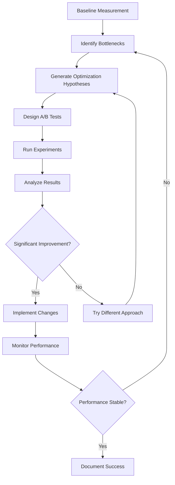

# Advanced Prompt Optimization Tutorial

## Overview
This advanced tutorial teaches you how to optimize prompts for better performance, reliability, and user satisfaction. You'll learn A/B testing techniques, performance measurement, and iterative improvement strategies used by expert prompt engineers.

## Prerequisites
- Completed [Basic Prompt Creation Tutorial](basic-prompt-creation.md)
- Understanding of prompt engineering fundamentals
- Access to CCPR analytics and testing tools
- Familiarity with data analysis basics

## Learning Objectives
After completing this tutorial, you will:
- Master advanced prompt optimization techniques
- Understand how to measure and improve prompt performance
- Know how to conduct A/B tests for prompt variations
- Be able to analyze user feedback and usage patterns
- Implement systematic optimization workflows

## Advanced Optimization Strategies

### 1. Performance Measurement Framework

#### 1.1 Key Performance Indicators (KPIs)
```yaml
Prompt Performance Metrics:
  effectiveness:
    accuracy: "Percentage of correct/useful outputs"
    relevance: "How well outputs match user intent"
    completeness: "Thoroughness of responses"
    
  efficiency:
    response_time: "Time to generate output"
    token_usage: "Input/output token efficiency"
    retry_rate: "How often users need to retry"
    
  user_satisfaction:
    adoption_rate: "How frequently prompt is used"
    user_ratings: "Explicit user feedback scores"
    completion_rate: "Users who complete the full workflow"
    
  reliability:
    consistency: "Similar inputs produce similar outputs"
    error_rate: "Frequency of invalid/empty responses"
    robustness: "Performance across edge cases"
```

#### 1.2 Measurement Implementation
```python
# Example analytics tracking
class PromptPerformanceTracker:
    def __init__(self, prompt_id, version):
        self.prompt_id = prompt_id
        self.version = version
        self.metrics = {
            'usage_count': 0,
            'success_rate': 0.0,
            'avg_response_time': 0.0,
            'user_ratings': [],
            'error_types': {}
        }
    
    def track_usage(self, input_text, output_text, response_time, success=True):
        """Track individual prompt usage"""
        self.metrics['usage_count'] += 1
        
        if success:
            self.metrics['success_rate'] = self._calculate_success_rate()
        
        self.metrics['avg_response_time'] = self._update_avg_response_time(response_time)
        
        # Log for detailed analysis
        self._log_usage_event({
            'timestamp': datetime.now(),
            'input_length': len(input_text),
            'output_length': len(output_text),
            'response_time': response_time,
            'success': success
        })
```

### 2. A/B Testing for Prompt Optimization

#### 2.1 Setting Up A/B Tests
```yaml
A/B Test Configuration:
  test_name: "sentiment_analysis_optimization_v2"
  
  variants:
    control:
      version: "1.0.0"
      prompt_file: "label_sentiment.md"
      traffic_percentage: 50
      
    treatment:
      version: "1.1.0-test"
      prompt_file: "label_sentiment_optimized.md"
      traffic_percentage: 50
      
  success_metrics:
    primary: "accuracy_score"
    secondary: ["user_satisfaction", "response_time"]
    
  duration: "14 days"
  min_sample_size: 1000
  significance_threshold: 0.05
```

#### 2.2 Test Variants Design
```markdown
# Control Variant (Current Prompt)
Analyze the sentiment of the following text:

{input_text}

Respond with: positive, negative, or neutral

# Treatment Variant (Optimized)
You are an expert sentiment analyzer. Carefully read the text below and determine its emotional tone.

Text: "{input_text}"

Consider:
- Overall emotional tone
- Context and nuance
- Implicit meanings

Classify as exactly one of: positive, negative, neutral

Your classification:
```

#### 2.3 Statistical Analysis
```python
# A/B test analysis script
import scipy.stats as stats
import numpy as np

def analyze_ab_test(control_data, treatment_data, metric='accuracy'):
    """Analyze A/B test results for statistical significance"""
    
    control_values = [d[metric] for d in control_data]
    treatment_values = [d[metric] for d in treatment_data]
    
    # Perform t-test
    t_stat, p_value = stats.ttest_ind(control_values, treatment_values)
    
    # Calculate effect size (Cohen's d)
    pooled_std = np.sqrt(((len(control_values) - 1) * np.var(control_values) + 
                         (len(treatment_values) - 1) * np.var(treatment_values)) / 
                        (len(control_values) + len(treatment_values) - 2))
    
    cohens_d = (np.mean(treatment_values) - np.mean(control_values)) / pooled_std
    
    results = {
        'control_mean': np.mean(control_values),
        'treatment_mean': np.mean(treatment_values),
        'improvement': (np.mean(treatment_values) - np.mean(control_values)) / np.mean(control_values) * 100,
        'p_value': p_value,
        'effect_size': cohens_d,
        'significant': p_value < 0.05,
        'sample_sizes': {
            'control': len(control_values),
            'treatment': len(treatment_values)
        }
    }
    
    return results
```

### 3. Advanced Prompt Engineering Techniques

#### 3.1 Chain-of-Thought Optimization
```markdown
# Before: Direct instruction
Classify the sentiment: "The movie was okay, I guess."

# After: Chain-of-thought reasoning
Let's analyze this text step by step:

Text: "The movie was okay, I guess."

Step 1: Identify key sentiment words
- "okay" = neutral/mild positive
- "I guess" = uncertainty/hedging

Step 2: Consider overall tone
- Lukewarm response
- Lack of enthusiasm
- Hesitant language

Step 3: Determine classification
Based on the hedging language and lukewarm response, this expresses neutral sentiment with slight negative undertones.

Classification: neutral
```

#### 3.2 Few-Shot Learning Optimization
```python
# Dynamic example selection based on input similarity
class ExampleSelector:
    def __init__(self, example_bank):
        self.examples = example_bank
        self.vectorizer = TfidfVectorizer()
        self.example_vectors = self.vectorizer.fit_transform([ex['input'] for ex in example_bank])
    
    def select_best_examples(self, input_text, n_examples=3):
        """Select most relevant examples for few-shot learning"""
        input_vector = self.vectorizer.transform([input_text])
        similarities = cosine_similarity(input_vector, self.example_vectors)[0]
        
        # Get top n most similar examples
        top_indices = np.argsort(similarities)[-n_examples:][::-1]
        
        return [self.examples[i] for i in top_indices]

# Usage in prompt generation
def generate_optimized_prompt(input_text, base_prompt, example_selector):
    relevant_examples = example_selector.select_best_examples(input_text)
    
    examples_text = "\n\n".join([
        f"Example: {ex['input']}\nSentiment: {ex['output']}" 
        for ex in relevant_examples
    ])
    
    return f"{base_prompt}\n\n{examples_text}\n\nNow analyze: {input_text}"
```

#### 3.3 Constraint-Based Optimization
```markdown
# Optimized prompt with explicit constraints
Analyze the sentiment of the given text with the following requirements:

CONSTRAINTS:
1. Use exactly one word: "positive", "negative", or "neutral"
2. If confidence < 70%, respond "neutral"
3. Ignore obvious sarcasm indicators
4. Consider context within the domain: {domain}

DECISION FRAMEWORK:
- Positive: Clear positive emotions, satisfaction, praise
- Negative: Clear complaints, dissatisfaction, criticism  
- Neutral: Mixed signals, factual statements, unclear intent

Text to analyze: "{input_text}"

Your response (one word only):
```

### 4. Performance Optimization Strategies

#### 4.1 Token Efficiency Optimization
```python
def optimize_prompt_length(original_prompt, test_inputs, quality_threshold=0.85):
    """Systematically reduce prompt length while maintaining quality"""
    
    # Test removing different sections
    sections_to_test = [
        'verbose_examples',
        'detailed_guidelines', 
        'redundant_instructions',
        'optional_context'
    ]
    
    best_prompt = original_prompt
    best_score = evaluate_prompt_quality(original_prompt, test_inputs)
    
    for section in sections_to_test:
        reduced_prompt = remove_section(original_prompt, section)
        score = evaluate_prompt_quality(reduced_prompt, test_inputs)
        
        if score >= quality_threshold and score >= best_score:
            best_prompt = reduced_prompt
            best_score = score
            
    return best_prompt, best_score

def evaluate_prompt_quality(prompt, test_inputs):
    """Evaluate prompt performance on test dataset"""
    scores = []
    for test_case in test_inputs:
        result = run_prompt(prompt, test_case['input'])
        score = calculate_accuracy(result, test_case['expected'])
        scores.append(score)
    
    return np.mean(scores)
```

#### 4.2 Response Time Optimization
```markdown
Optimization Techniques:
1. **Reduce Prompt Length**: Remove unnecessary verbosity
2. **Simplify Instructions**: Use clear, concise language
3. **Optimize Examples**: Use fewer, more focused examples
4. **Structured Output**: Request specific formats to reduce generation time

# Before (slower)
Please carefully analyze the sentiment of the following text, considering all nuances, context, cultural implications, and implicit meanings. Provide a detailed explanation of your reasoning process, including identification of key emotional indicators, contextual factors, and any ambiguities you encountered during your analysis.

# After (faster)
Classify sentiment: positive, negative, or neutral

Text: "{input_text}"
Classification:
```

### 5. Systematic Optimization Workflow

#### 5.1 Optimization Process


#### 5.2 Optimization Checklist
```yaml
Optimization Checklist:
  preparation:
    □ Establish baseline metrics
    □ Define success criteria
    □ Prepare test datasets
    □ Set up analytics tracking
    
  experimentation:
    □ Design controlled experiments
    □ Implement A/B testing framework
    □ Ensure adequate sample sizes
    □ Control for external variables
    
  analysis:
    □ Calculate statistical significance
    □ Measure effect sizes
    □ Analyze user feedback
    □ Document findings
    
  implementation:
    □ Gradual rollout strategy
    □ Monitor for regressions
    □ Update documentation
    □ Train user community
```

### 6. Real-World Optimization Example

#### 6.1 Case Study: Email Classification Prompt
```markdown
Original Problem:
- Email classification prompt had 65% accuracy
- Users complained about inconsistent results
- High retry rate (23%)

Optimization Process:

1. Baseline Analysis:
   - Collected 2000 test emails
   - Identified common failure patterns
   - Surveyed user feedback

2. Hypothesis Generation:
   - Too many categories (8) causing confusion
   - Examples weren't representative
   - Instructions were ambiguous

3. Optimization Variants:
   A. Reduced categories from 8 to 4
   B. Added category decision tree
   C. Improved examples with edge cases
   D. Combined all improvements

4. A/B Test Results:
   - Variant A: 71% accuracy (+6%)
   - Variant B: 73% accuracy (+8%)
   - Variant C: 78% accuracy (+13%)
   - Variant D: 82% accuracy (+17%)

5. Implementation:
   - Rolled out Variant D gradually
   - Monitored for 30 days
   - Updated training materials
   - Collected user feedback
```

#### 6.2 Lessons Learned
```markdown
Key Insights:
1. Small changes can have big impacts
2. User feedback is invaluable
3. Statistical significance matters
4. Monitor long-term effects
5. Document everything

Common Pitfalls:
- Optimizing for the wrong metric
- Insufficient sample sizes
- Not controlling for external factors
- Overfitting to test data
- Ignoring user experience
```

### 7. Advanced Analytics and Monitoring

#### 7.1 Performance Dashboard
```python
class PromptPerformanceDashboard:
    def __init__(self):
        self.metrics = {}
        
    def generate_performance_report(self, prompt_id, time_period):
        """Generate comprehensive performance report"""
        
        # Collect metrics
        usage_data = self.get_usage_data(prompt_id, time_period)
        quality_metrics = self.calculate_quality_metrics(usage_data)
        user_feedback = self.get_user_feedback(prompt_id, time_period)
        
        # Performance trends
        trends = self.analyze_trends(usage_data)
        
        # Generate insights
        insights = self.generate_insights(quality_metrics, trends, user_feedback)
        
        report = {
            'summary': {
                'total_usage': len(usage_data),
                'average_accuracy': quality_metrics['accuracy'],
                'user_satisfaction': user_feedback['avg_rating'],
                'trend': trends['overall_trend']
            },
            'detailed_metrics': quality_metrics,
            'user_feedback_summary': user_feedback,
            'performance_trends': trends,
            'optimization_recommendations': insights['recommendations'],
            'alerts': insights['alerts']
        }
        
        return report
```

#### 7.2 Automated Alert System
```python
class PromptMonitoringSystem:
    def __init__(self):
        self.alert_thresholds = {
            'accuracy_drop': 0.05,  # 5% drop triggers alert
            'error_rate_spike': 0.10,  # 10% error rate
            'usage_drop': 0.30,  # 30% usage decrease
            'negative_feedback': 0.20  # 20% negative feedback
        }
    
    def check_for_alerts(self, prompt_performance):
        """Check if any metrics require immediate attention"""
        alerts = []
        
        # Check for accuracy drops
        if prompt_performance['accuracy_trend'] < -self.alert_thresholds['accuracy_drop']:
            alerts.append({
                'type': 'accuracy_degradation',
                'severity': 'high',
                'message': f"Accuracy dropped by {abs(prompt_performance['accuracy_trend']):.1%}",
                'recommended_action': 'Review recent changes and user feedback'
            })
        
        # Check for error rate spikes
        if prompt_performance['error_rate'] > self.alert_thresholds['error_rate_spike']:
            alerts.append({
                'type': 'error_rate_spike',
                'severity': 'critical',
                'message': f"Error rate is {prompt_performance['error_rate']:.1%}",
                'recommended_action': 'Investigate system issues or prompt problems'
            })
        
        return alerts
```

## Best Practices and Guidelines

### Optimization Best Practices
```markdown
1. **Start with Data**: Always measure before optimizing
2. **One Change at a Time**: Test individual improvements separately
3. **Consider User Context**: Optimize for real usage patterns
4. **Think Long-term**: Consider maintenance and evolution
5. **Document Everything**: Record decisions and results

Performance Guidelines:
- Target 90%+ accuracy for classification tasks
- Keep response time under 3 seconds
- Maintain 95%+ uptime
- Achieve 80%+ user satisfaction scores

Quality Assurance:
- Test with diverse inputs
- Include edge cases
- Validate across user groups
- Monitor post-deployment
```

### Common Optimization Mistakes
```markdown
Mistakes to Avoid:
1. **Premature Optimization**: Optimizing before understanding the problem
2. **Overfitting**: Optimizing too specifically for test data
3. **Ignoring Users**: Focusing on metrics instead of user experience
4. **Insufficient Testing**: Not testing with enough data
5. **Missing Baselines**: Not establishing proper comparison points

Red Flags:
- Optimization improves one metric but hurts others
- Improvement only works on test data
- Users report decreased satisfaction despite better metrics
- Changes require frequent maintenance
```

## Next Steps and Advanced Topics

### Advanced Techniques to Explore
1. **Multi-Model Optimization**: Testing across different AI models
2. **Dynamic Prompting**: Adapting prompts based on context
3. **Ensemble Methods**: Combining multiple prompt strategies
4. **Reinforcement Learning**: Using feedback to improve prompts automatically

### Recommended Reading
- [Prompt Engineering Research Papers](../reference/research-papers.md)
- [Advanced Statistical Methods](../reference/statistical-analysis.md)
- [Machine Learning for Prompt Optimization](../reference/ml-optimization.md)

### Tools and Resources
- A/B Testing Frameworks
- Analytics Dashboards
- User Feedback Systems
- Performance Monitoring Tools

## Conclusion

Advanced prompt optimization is both an art and a science. It requires systematic measurement, careful experimentation, and continuous improvement. The techniques you've learned in this tutorial will help you create highly effective prompts that deliver exceptional value to your users.

Remember that optimization is an ongoing process. User needs evolve, AI models improve, and new use cases emerge. Stay curious, keep experimenting, and always prioritize your users' success.

## Quick Reference

### Optimization Workflow
```markdown
1. Measure baseline performance
2. Identify improvement opportunities
3. Design experiments
4. Test systematically
5. Analyze results statistically
6. Implement successful changes
7. Monitor and iterate
```

### Key Metrics to Track
- Accuracy/Quality scores
- Response time
- User satisfaction
- Usage frequency
- Error rates
- Completion rates

For advanced optimization support, contact the CCPR Expert Team at [ccpr-experts@company.com](mailto:ccpr-experts@company.com).