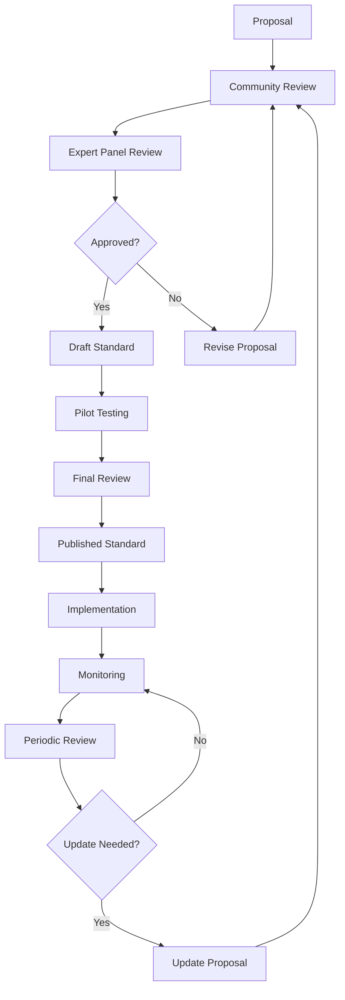

# CCPR Shared Standards

## Overview
This directory contains standardized guidelines, best practices, and specifications that ensure consistency and quality across all CCPR implementations. These standards are designed to be adaptable to different organizational contexts while maintaining core principles.

## Standards Categories

### Core Standards
- **[Prompt Quality Standards](prompt-quality-standards.md)**: Comprehensive quality criteria for all prompts
- **[Documentation Standards](documentation-standards.md)**: Guidelines for creating clear, comprehensive documentation
- **[Naming Conventions](naming-conventions.md)**: Standardized naming patterns for files, prompts, and categories
- **[Version Control Standards](version-control-standards.md)**: Git workflow and versioning guidelines

### Technical Standards
- **[API Standards](api-standards.md)**: Guidelines for AI platform integration
- **[Security Standards](security-standards.md)**: Security requirements and best practices
- **[Performance Standards](performance-standards.md)**: Performance benchmarks and optimization guidelines
- **[Integration Standards](integration-standards.md)**: Standards for tool and platform integration

### Process Standards
- **[Review Process Standards](review-process-standards.md)**: Standardized review and approval workflows
- **[Testing Standards](testing-standards.md)**: Guidelines for prompt testing and validation
- **[Release Management Standards](release-management-standards.md)**: Standards for managing prompt releases
- **[Governance Standards](governance-standards.md)**: Framework for organizational governance

### Compliance Standards
- **[Data Protection Standards](data-protection-standards.md)**: Privacy and data protection requirements
- **[Regulatory Compliance Standards](regulatory-compliance-standards.md)**: Multi-framework compliance guidelines
- **[Audit Standards](audit-standards.md)**: Requirements for audit trails and documentation
- **[Risk Management Standards](risk-management-standards.md)**: Risk assessment and mitigation standards

## Using These Standards

### Implementation Approach
```yaml
Standards Implementation:
  assessment:
    step: "Evaluate current state against standards"
    output: "Gap analysis and implementation plan"
    
  adaptation:
    step: "Customize standards for your organization"
    output: "Organization-specific standard documents"
    
  rollout:
    step: "Implement standards across teams"
    output: "Training materials and compliance tracking"
    
  monitoring:
    step: "Monitor compliance and effectiveness"
    output: "Regular compliance reports and improvements"
```

### Compliance Levels
- **Level 1 - Basic**: Essential standards for getting started
- **Level 2 - Intermediate**: Enhanced standards for growing implementations
- **Level 3 - Advanced**: Comprehensive standards for enterprise deployments
- **Level 4 - Expert**: Cutting-edge standards for innovation leaders

### Customization Guidelines
1. **Maintain Core Principles**: Preserve essential quality and security requirements
2. **Adapt to Context**: Modify standards to fit organizational culture and needs
3. **Document Variations**: Clearly document any deviations from base standards
4. **Ensure Compatibility**: Maintain compatibility with CCPR tools and processes
5. **Regular Review**: Establish processes for regular standard updates

## Quality Assurance Framework

### Quality Dimensions
```yaml
Quality Framework:
  effectiveness:
    description: "How well prompts achieve their intended purpose"
    metrics: ["accuracy", "relevance", "completeness"]
    targets: ["accuracy > 90%", "relevance > 85%", "completeness > 95%"]
    
  efficiency:
    description: "Resource optimization and performance"
    metrics: ["response_time", "token_usage", "cost_per_operation"]
    targets: ["response_time < 3s", "optimal_token_usage", "cost_effective"]
    
  usability:
    description: "Ease of use and adoption"
    metrics: ["adoption_rate", "user_satisfaction", "documentation_clarity"]
    targets: ["adoption > 80%", "satisfaction > 4.0/5", "clarity > 90%"]
    
  reliability:
    description: "Consistency and dependability"
    metrics: ["uptime", "error_rate", "consistency_score"]
    targets: ["uptime > 99%", "error_rate < 1%", "consistency > 95%"]
    
  maintainability:
    description: "Long-term sustainability and evolution"
    metrics: ["update_frequency", "maintenance_burden", "technical_debt"]
    targets: ["regular_updates", "low_maintenance", "minimal_debt"]
```

### Assessment Methods
- **Automated Testing**: Continuous validation through automated scripts
- **Peer Review**: Systematic review by subject matter experts
- **User Feedback**: Regular collection and analysis of user experiences
- **Performance Monitoring**: Ongoing tracking of key performance indicators
- **Compliance Audits**: Periodic formal audits of standard adherence

## Governance Framework

### Standard Lifecycle


### Roles and Responsibilities
```yaml
Governance Roles:
  standards_committee:
    responsibility: "Overall standard strategy and approval"
    members: ["technical_leads", "domain_experts", "community_representatives"]
    
  working_groups:
    responsibility: "Develop specific standards"
    members: ["subject_matter_experts", "practitioners", "stakeholders"]
    
  reviewers:
    responsibility: "Review and validate proposed standards"
    members: ["experienced_practitioners", "compliance_experts", "security_specialists"]
    
  implementers:
    responsibility: "Apply standards in practice"
    members: ["development_teams", "operations_teams", "end_users"]
```

### Decision-Making Process
1. **Consensus Building**: Seek broad agreement from stakeholders
2. **Expert Review**: Validate technical accuracy and feasibility
3. **Impact Assessment**: Evaluate effects on existing implementations
4. **Pilot Testing**: Test standards in controlled environments
5. **Final Approval**: Formal approval by standards committee

## Compliance and Monitoring

### Compliance Tracking
```yaml
Compliance Metrics:
  adherence_rate:
    description: "Percentage of implementations following standards"
    target: "> 95%"
    measurement: "Automated compliance checks"
    
  deviation_tracking:
    description: "Number and severity of standard deviations"
    target: "< 5% major deviations"
    measurement: "Regular audit reports"
    
  improvement_rate:
    description: "Rate of compliance improvement over time"
    target: "Continuous improvement"
    measurement: "Trend analysis"
```

### Monitoring Tools
- **Compliance Dashboards**: Real-time compliance status tracking
- **Automated Validation**: Continuous checking against standards
- **Audit Reports**: Regular formal compliance assessments
- **Trend Analysis**: Long-term compliance pattern analysis

### Non-Compliance Management
1. **Detection**: Identify compliance gaps through monitoring
2. **Assessment**: Evaluate impact and risk level
3. **Planning**: Develop remediation plan with timeline
4. **Implementation**: Execute compliance improvements
5. **Verification**: Confirm compliance restoration

## Training and Certification

### Training Programs
```yaml
Training Levels:
  basic_awareness:
    audience: "All CCPR users"
    content: "Overview of standards and their importance"
    duration: "1-2 hours"
    
  practitioner_level:
    audience: "Content creators and reviewers"
    content: "Detailed standard application and best practices"
    duration: "4-6 hours"
    
  expert_level:
    audience: "Standard maintainers and auditors"
    content: "Standard development and governance processes"
    duration: "16-20 hours"
    
  specialist_track:
    audience: "Domain-specific roles"
    content: "Specialized standards for specific domains"
    duration: "8-12 hours"
```

### Certification Framework
- **Standards Practitioner**: Demonstrates competency in applying standards
- **Standards Reviewer**: Qualified to review compliance and quality
- **Standards Contributor**: Authorized to propose and develop standards
- **Standards Expert**: Recognized expert in standards development and governance

## Tools and Automation

### Standard Validation Tools
```python
# Example: Automated compliance checker
class StandardsValidator:
    def __init__(self):
        self.standards = self.load_standards()
        self.validators = self.initialize_validators()
    
    def validate_prompt(self, prompt_file):
        """Validate a prompt against all applicable standards"""
        results = {}
        
        for standard_name, standard in self.standards.items():
            validator = self.validators[standard_name]
            result = validator.validate(prompt_file)
            results[standard_name] = result
        
        return self.aggregate_results(results)
    
    def generate_compliance_report(self, validation_results):
        """Generate comprehensive compliance report"""
        return {
            'overall_compliance': self.calculate_overall_score(validation_results),
            'standard_breakdown': validation_results,
            'recommendations': self.generate_recommendations(validation_results),
            'action_items': self.identify_action_items(validation_results)
        }
```

### Integration with Development Workflow
- **Pre-commit Hooks**: Validate standards before code commits
- **CI/CD Pipeline**: Automated standard checking in continuous integration
- **IDE Extensions**: Real-time standard validation in development environments
- **Documentation Generation**: Automatic compliance documentation

## Community and Collaboration

### Open Source Approach
- **Transparent Development**: All standard development is public
- **Community Contribution**: Anyone can propose improvements
- **Collaborative Review**: Standards benefit from diverse perspectives
- **Shared Innovation**: Best practices are shared across organizations

### Contributing to Standards
1. **Identify Needs**: Recognize gaps or improvement opportunities
2. **Propose Solutions**: Submit detailed proposals with rationale
3. **Engage Community**: Participate in discussions and reviews
4. **Pilot Testing**: Test proposed standards in real environments
5. **Iterate and Improve**: Refine based on feedback and results

### Community Resources
- **Standards Forum**: [standards.ccpr.community](https://standards.ccpr.community)
- **Working Groups**: Specialized groups for different standard areas
- **Office Hours**: Regular sessions for questions and guidance
- **Annual Conference**: Yearly gathering for standards community

## Metrics and Success Indicators

### Adoption Metrics
```yaml
Success Indicators:
  adoption_metrics:
    - "Number of organizations using standards"
    - "Percentage of prompts compliant with standards"
    - "User satisfaction with standard quality"
    
  quality_metrics:
    - "Reduction in prompt-related issues"
    - "Improvement in prompt effectiveness"
    - "Decrease in review cycle times"
    
  innovation_metrics:
    - "Number of standard improvements proposed"
    - "Speed of standard evolution"
    - "Cross-pollination between organizations"
```

### Reporting and Analytics
- **Monthly Compliance Reports**: Track compliance trends
- **Quarterly Quality Reviews**: Assess standard effectiveness
- **Annual Standards Survey**: Gather community feedback
- **Impact Assessment**: Measure business value of standards

## Future Roadmap

### Evolution Strategy
```yaml
Roadmap Themes:
  2024_focus:
    - "Enhanced automation and tooling"
    - "Expanded compliance framework"
    - "Improved user experience"
    
  2025_vision:
    - "AI-assisted standard compliance"
    - "Predictive quality analytics"
    - "Cross-industry collaboration"
    
  long_term_goals:
    - "Industry-wide standard adoption"
    - "Automated standard evolution"
    - "Semantic standard understanding"
```

### Emerging Areas
- **AI Ethics Standards**: Guidelines for responsible AI prompt development
- **Interoperability Standards**: Cross-platform compatibility requirements
- **Sustainability Standards**: Environmental impact considerations
- **Accessibility Standards**: Inclusive design requirements

## Resources and Support

### Documentation
- [Implementation Guides](implementation/)
- [Best Practice Examples](examples/)
- [Tool Documentation](tools/)
- [Training Materials](training/)

### Support Channels
- **Standards Help Desk**: [standards-help@ccpr.community](mailto:standards-help@ccpr.community)
- **Technical Support**: [tech-support@ccpr.community](mailto:tech-support@ccpr.community)
- **Community Forum**: [forum.ccpr.community](https://forum.ccpr.community)

### Contact Information
- **Standards Committee Chair**: [chair@standards.ccpr.community](mailto:chair@standards.ccpr.community)
- **Working Group Coordinators**: [coordinators@standards.ccpr.community](mailto:coordinators@standards.ccpr.community)
- **Community Manager**: [community@standards.ccpr.community](mailto:community@standards.ccpr.community)

---

*The CCPR Standards are a community-driven initiative to improve the quality, consistency, and reliability of AI prompt repositories across organizations. Join us in building the future of prompt engineering!*